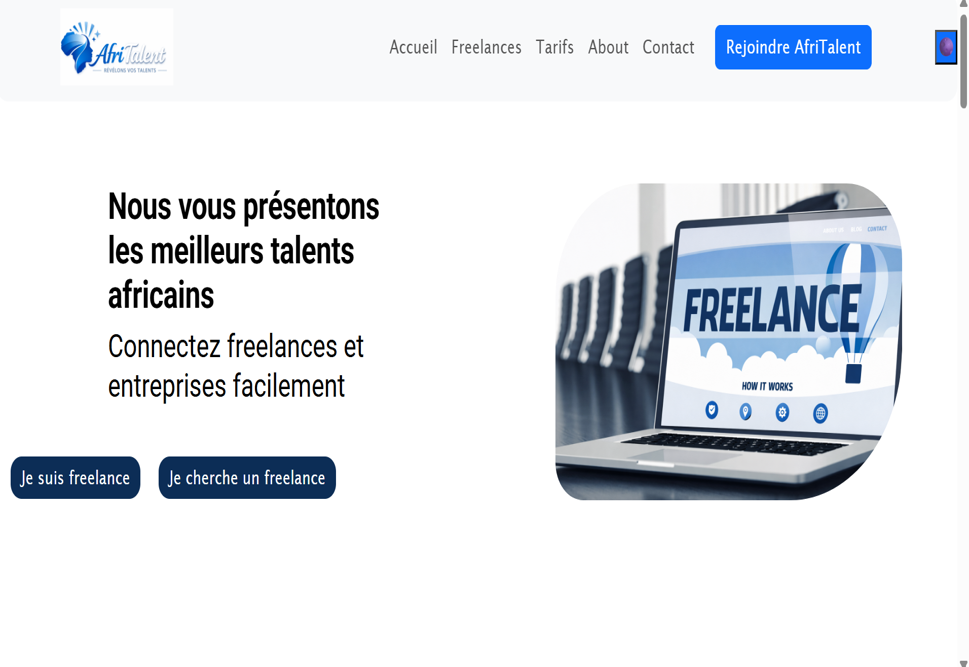

# AfriTalent 
Projet fil rouge — Plateforme de mise en relation entre freelances africains et 
clients. 
Auteur : Yacouba Seydou Ndiaye
Promotion : L1 Web — ISI 

AfriTalent est une plateforme web qui connecte les **freelances africains** et les **entreprises**.  
Ce projet est une vitrine de compétences en **HTML, CSS, Bootstrap 5 et JavaScript**.

---

## 🚀 Déploiement

Le site est disponible en ligne via GitHub Pages :  
👉 [Accéder à AfriTalent]

---

## 📑 Sommaire

- Contexte du projet
- Objectifs pédagogiques
- Pages principales
- Fonctionnalités JavaScript
- Optimisations
- Déploiement
- Capture d’écran
- Conclusion

---

## 🎯 Objectifs

- Créer un site web responsive et moderne  
- Maîtriser **HTML5, CSS3, Bootstrap 5, JavaScript**  
- Utiliser Git & GitHub pour le versioning et le déploiement  
- Présenter le projet avec un **PowerPoint**  

---

## 📂 Pages principales

- **Accueil (index.html)** : Hero, statistiques, étapes, catégories de services  
- **Freelances (freelances.html)** : catalogue de profils avec filtrage dynamique  
- **Tarifs (tarifs.html)** : 3 plans tarifaires + FAQ interactive  
- **À propos (about.html)** : histoire, équipe, valeurs, chiffres clés  
- **Contact (contact.html)** : formulaire validé en JS + Google Maps  

---

## ⚙️ Fonctionnalités JavaScript

- 🌑 Dark mode avec localStorage  
- 📊 Compteurs animés au scroll  
- ✅ Validation du formulaire de contact (regex email, message ≥ 20 caractères)  
- ⬆ Bouton retour en haut  

---

## 🛠️ Optimisations

- Code HTML, CSS et JS **commenté et indenté**  
- Responsive corrigé sur toutes les pages  
- Validation W3C (0 erreur bloquante)  
- Attributs `alt` vérifiés sur toutes les images  

---

## 📸 Capture d’écran

---

## 📊 Présentation PowerPoint

La présentation est disponible dans le dossier :  
`docs/NDIAYE_YACOUBA SEYDOU_Presentation.pptx`

---

## ✅ Conclusion

- Projet vitrine de compétences web  
- Site responsive, validé et optimisé  

---

👨‍💻 **Auteur** : YACOUBA_SEYDOU_NDIAYE
📅 **Date** : Juin 2026